---
output:
  html_document: default
  pdf_document: default
---
# S1 · Intro au cours & Méthodes qualitatives

> **Source** : `S1_CourseIntro_and_QualitativeMethod_Operationalization.pdf` (83 pages)
> **Pages couvertes** : 1–83 ✅ exhaustif
> **Statut** : ✅ Complet
> **Type** : Lecture lourde — logistique du cours + théorie qualitative complète + outlook synthetic data

---

## 🎯 De quoi parle vraiment cette session

> **Hook** : Imagine que Matrix te demande de comprendre pourquoi les jeunes adultes n'achètent pas leurs produits capillaires premium. Tu peux leur balancer un sondage à 1 000 personnes — mais ça te donnera des chiffres sur ce qu'ils font, pas sur **pourquoi** ils le font. La méthode qualitative, c'est l'outil pour creuser le **pourquoi**.

**Idée centrale** : la recherche qualitative, c'est l'art de comprendre les motivations, les expériences et les perceptions humaines en profondeur, là où les chiffres ne suffisent pas. S1 te donne la théorie pour conduire des **interviews** et des **focus groups** rigoureux.

---

## 1. Logistique du cours — à connaître par cœur

### 1.1. Les 9 sessions [slide 2 + 82]


| Session | Type | Ce qui s'y passe |
|---|---|---|
| **S1, S2** | Lecture | Intro + guidelines quali (S1) puis guidelines quanti + AI exercise "Design Under Fire" (S2) |
| **S3, S4** | Lecture | Pratique quali (S3) puis implémentation quanti dans Qualtrics (S4) |
| **S5** | Coaching | Validation du plan de collecte avant de lancer |
| **S6** | Lecture | Analyse des données quali ET quanti |
| **S7** | Coaching | Validation de l'analyse |
| **Submit** | — | Slides + Report + Data, deadline 23h59 la veille de S8 |
| **S8** | — | Présentations toute la cohorte |
| **S9** | — | Présentations sélectionnées devant Matrix (8 avril) |
| **30 avril** | Examen final | 90 min, Respondus lockdown, **50% de la note** |

### 1.2. Évaluation
- **50%** projet groupe Matrix
- **50%** examen final 30 avril, 90 min, navigateur Respondus lockdown

### 1.3. Livrables du projet Matrix
1. **Slides PDF** de présentation (8 min strictes)
2. **Rapport Word** format APA, **8 sections** :
   1. Introduction
   2. Research design & data collection
   3. Data analyses
   4. Interpretation
   5. Conclusions & recommendations
   6. Limitations
   7. References
   8. Individual contribution statements
3. **Preuves de collecte** :
   - Quali → vidéos + transcripts + codage Taguette
   - Quanti → collaboration Qualtrics + dataset + script SPSS

### 1.4. Règles de classe et absences [slide 21]
- Un seul orateur à la fois
- Ponctualité, pas de laptop/téléphone sauf besoin
- **Badger soi-même uniquement**
- Les profs **ne peuvent PAS** excuser une absence : justifications **directement au HUB**

> **⚠️ Piège** : envoyer un mail au prof pour justifier une absence. Ça ne sert à rien — il faut passer par le HUB.

---

## 2. Le processus de recherche [slide 16-19]

> **💡 Intuition** : avant de toucher à un outil (Qualtrics, SPSS, Taguette), il y a une chaîne logique à respecter. Sinon tu vas chercher des réponses... à des questions que tu ne t'es jamais vraiment posées.

```
Problème managérial
  → Questions managériales
    → Questions de recherche (RQ)
      → Choix méthodologique (quali ou quanti ?)
        → Research design
          → Collecte de données
            → Analyse
              → Interprétation
                → Conclusions & recommandations
```

> **🎯 Exemple Matrix** : "Matrix perd des parts de marché chez les 25-35 ans" (problème managérial) → "Pourquoi cette tranche d'âge nous délaisse-t-elle ?" (RQ) → "Méthode quali, interviews semi-structurées avec utilisateurs et non-utilisateurs" (méthodo) → ...

---

## 3. Quali vs Quanti : la grande distinction [slide 24]

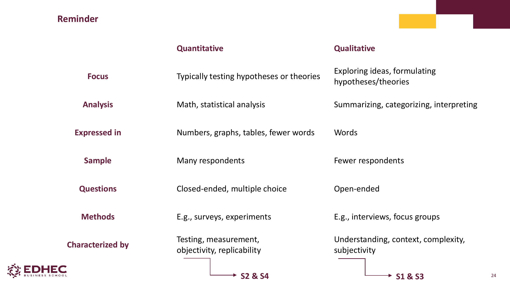

> **💡 Intuition courte** : **Quali = on explore, on creuse le pourquoi.** **Quanti = on teste, on quantifie le combien.**

| Dimension | Quantitatif | Qualitatif |
|---|---|---|
| **Focus** | Tester hypothèses / théories | Explorer idées, formuler hypothèses |
| **Analyse** | Maths, statistiques | Résumer, catégoriser, interpréter |
| **Format** | Nombres, graphiques, tableaux | Mots |
| **Échantillon** | Beaucoup de répondants | Peu de répondants |
| **Questions** | Fermées, choix multiples | Ouvertes |
| **Méthodes** | Surveys, expériences | Interviews, focus groups |
| **Caractérisé par** | Test, mesure, objectivité, réplicabilité | Compréhension, contexte, complexité, subjectivité |
| **Sessions du cours** | S2 & S4 | S1 & S3 |

---

## 4. Définition et données qualitatives

### 4.1. Définition de la recherche qualitative [slide 25]

> *"Any type of research that produces findings **not arrived at by statistical procedures or other means of quantification**."* — **Strauss & Corbin (1998)**

### 4.2. Méthodes de collecte qualitative [slide 26-27]

**Données primaires** (créées pour l'étude) :
- **Interviews longues** : in-depth interviews et focus groups ⭐
- **Observation** ou observation participante en contexte réel
- **Observation/participation en ligne**
- **Techniques projectives ou auto-driving** : photos ou textes produits par les informants pour faire émerger les insights

**Données secondaires** (archives — pas créées pour l'étude) :
- **Textes** (journaux)
- **Images** (photos Instagram)
- **Audio** (podcasts)
- **Objets** (œuvres d'art)

> **🎯 Action concrète** : pour Matrix, tu pourrais analyser des avis Trustpilot (texte secondaire) ou demander à des utilisateurs de prendre des photos de leur routine capillaire (auto-driving primaire).

---

## 5. Interview vs Focus Group : choisir le bon outil [slide 28-31]

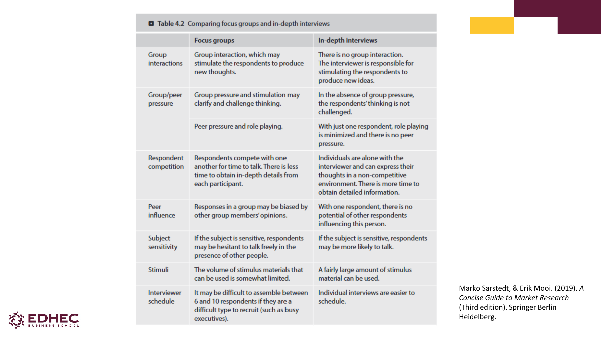

> **💡 Intuition** : **Interview** = un face à face, intime, profondeur maximale. **Focus group** = un groupe de 6-10, dynamique sociale, idées qui émergent du collectif.

### Tableau comparatif (Sarstedt & Mooi, 2019, table 4.2)

| Critère | Focus Group | In-depth Interview |
|---|---|---|
| **Interaction de groupe** | Stimule de nouvelles idées | Aucune — l'interviewer doit stimuler seul |
| **Pression du groupe** | Peut clarifier ou challenger la pensée | Pas de pression, pensée non challengée |
| **Compétition pour le temps** | Oui → moins de profondeur par participant | Aucune → plus de détails |
| **Influence des pairs** | Réponses biaisées par le groupe | Aucune influence |
| **Sujets sensibles** | Hésitation à parler en public | Plus de liberté pour s'exprimer |
| **Stimuli (vidéos, photos)** | Volume limité | Beaucoup de stimuli possibles |
| **Logistique** | Recruter 6-10 personnes simultanément = dur | Plus facile à organiser |

> **⚠️ Piège classique** : choisir le focus group "parce que c'est plus rapide". Faux. Si ton sujet est sensible (argent, santé, vie privée) ou si tu veux des récits profonds, l'interview individuelle gagne presque toujours.

> **🎯 Pour Matrix** : si tu veux comprendre la dynamique d'un groupe d'amis qui se conseillent mutuellement sur leur routine beauté → focus group. Si tu veux comprendre le rapport intime de quelqu'un à ses cheveux → interview.

---

## 6. Le processus type d'une étude qualitative [slide 29]

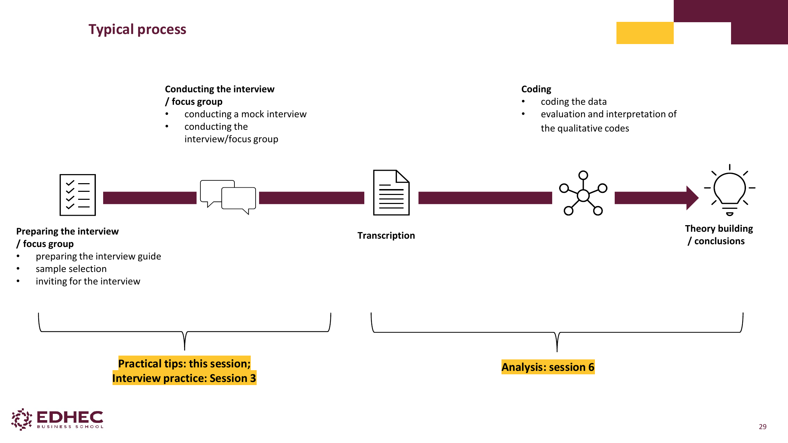

```
Préparation       →  Conduite     →  Transcription  →  Codage       →  Théorisation
(guide, sample,    (mock + vrai)                       (codes,         /conclusions
 invitations)                                           thèmes)
↑ Pratique S3      ↑ Pratique S3                      ↑ Analyse S6    ↑ Analyse S6
```

---

## 7. Les 3 types d'interviews qualitatives [slide 34]

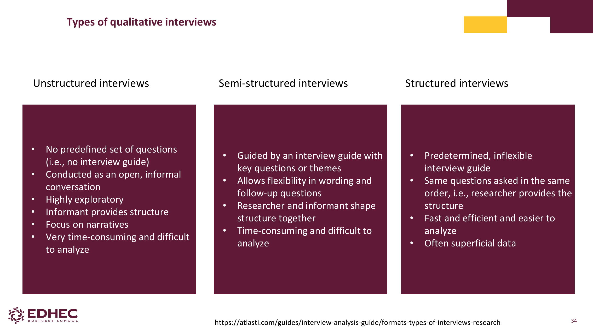

> **💡 Intuition** : c'est un curseur entre **liberté** (non structurée) et **rigueur** (structurée). La semi-structurée est le sweet spot pour la plupart des études marketing.

| Type | Caractéristiques | Quand l'utiliser |
|---|---|---|
| **Non structurée** | Pas de guide, conversation ouverte, l'informant donne la structure, focus narratif | Phase très exploratoire, sujets nouveaux |
| **Semi-structurée** ⭐ | Guide avec questions/thèmes clés, flexibilité dans le wording et les follow-ups, structure co-construite | **Format standard du cours et du projet Matrix** |
| **Structurée** | Guide rigide, mêmes questions dans le même ordre | Quand on veut comparer strictement plusieurs personnes |

> **⚠️ Piège** : croire que "non structurée" = "sans préparation". Au contraire, c'est la plus dure car tu dois improviser de bonnes relances en temps réel.

---

## 8. Préparer un bon guide d'interview [slide 35-37]

### 8.1. Règles d'or [slide 35]
- **Obtenir le consentement éclairé AVANT** de commencer
- Structure logique mais flexible
- Rester focus sur la RQ ("Que dois-je découvrir ?")
- Langage clair, sans jargon
- **Éviter les questions leading** ("Vous êtes d'accord que…?") et les yes/no
- Préparer des **follow-ups** pertinents
- Enregistrer infos basiques : nom, âge, genre, position

### 8.2. Structure typique [slide 36]

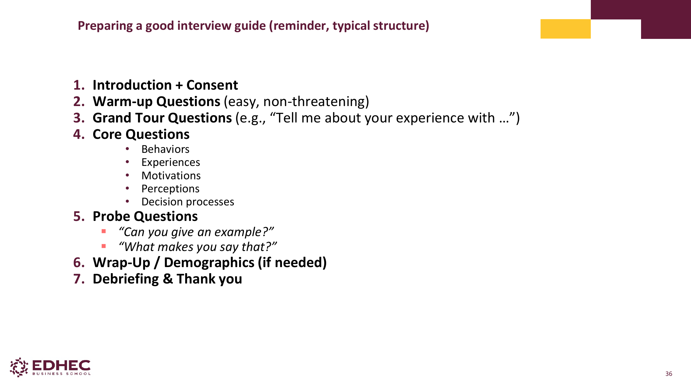

1. **Introduction + Consentement**
2. **Warm-up** (questions faciles, non menaçantes)
3. **Grand Tour** (large, ouvert : *"Tell me about your experience with…"*)
4. **Core Questions** : Behaviors · Experiences · Motivations · Perceptions · Decision processes
5. **Probe Questions** (creuser : *"Can you give an example?"*, *"What makes you say that?"*)
6. **Wrap-Up / Démographiques** (si pas demandés au début)
7. **Debriefing & Thank you**

### 8.3. Types de questions (Bryman, 2016) [slide 37]

| Type | Exemple |
|---|---|
| **Introducing** | *"Tell me about…"* |
| **Follow-up** | *"What do you mean by that?"* |
| **Probing** | *"Could you tell me more about…?"* |
| **Specifying** | *"What happened next?"* |
| **Direct** | *"Do you think that…?"* |
| **Indirect** | *"What do most people think about…?"* |
| **Structuring** | *"Let's move on to…"* |
| **Silence** | (laisser parler — sous-estimé !) |
| **Interpreting** | *"Do you mean that…?"* |

### 8.4. Exercice : bonne ou mauvaise question ? [slide 38]

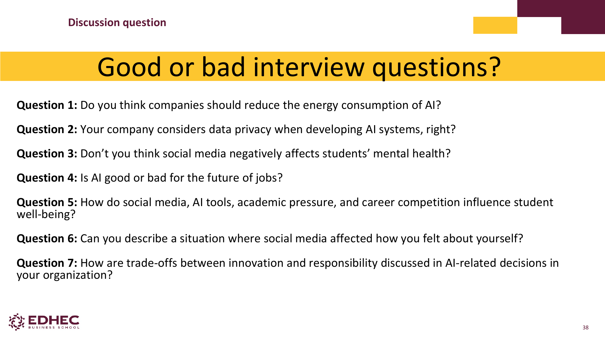

> **✅ Test toi** : analyse ces 7 questions (du slide 38). Lesquelles sont bonnes, lesquelles sont mauvaises et pourquoi ?
>
> 1. *"Do you think companies should reduce the energy consumption of AI?"* → ❌ **Leading** (suggère qu'il faudrait)
> 2. *"Your company considers data privacy when developing AI systems, right?"* → ❌ **Leading** + suppose une réponse
> 3. *"Don't you think social media negatively affects students' mental health?"* → ❌ **Leading** très fort
> 4. *"Is AI good or bad for the future of jobs?"* → ❌ **Binaire**, force un choix faux
> 5. *"How do social media, AI tools, academic pressure, and career competition influence student well-being?"* → ❌ **Trop de variables** (double-barreled puissance 4)
> 6. *"Can you describe a situation where social media affected how you felt about yourself?"* → ✅ **Très bonne** : ouverte, narrative, ancrée dans l'expérience
> 7. *"How are trade-offs between innovation and responsibility discussed in AI-related decisions in your organization?"* → ✅ **Bonne** pour un public expert, ouverte

---

## 9. Échantillonnage qualitatif [slide 39-42]

### 9.1. Choisir QUI interroger [slide 39-40]

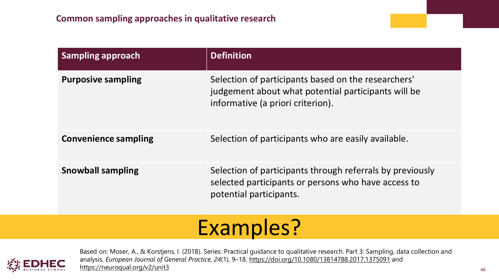

> **💡 Intuition** : en quanti tu cherches la **représentativité statistique**. En quali tu cherches des **informants riches** — des personnes qui ont beaucoup à dire sur ton sujet.

| Approche | Définition | Exemple Matrix |
|---|---|---|
| **Purposive** ⭐ | Sélection basée sur un critère a priori (informateurs riches en infos) | "Femmes 25-35 qui ont changé de marque capillaire dans les 12 derniers mois" |
| **Convenience** | Participants facilement accessibles | Étudiants de l'EDHEC autour de toi |
| **Snowball** | Référencements par les participants déjà recrutés | Une participante te recommande 2 amies |

### 9.2. Combien d'interviews ? [slide 41-42]

- Pas de norme universelle. **10 à 100** en pratique selon RQ et difficulté d'accès
- Échantillons toujours bien plus petits qu'en quanti
- Sujet large → échantillon plus grand
- **Critère principal : data saturation** (Moser & Korstjens, 2018)

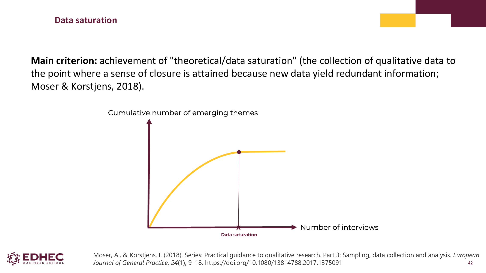

> **💡 Intuition data saturation** : tu continues d'interviewer tant que chaque nouvelle interview apporte de **nouveaux thèmes**. Quand tu fais 3 interviews d'affilée sans rien apprendre de neuf — tu as atteint la saturation, tu peux arrêter.

---

## 10. Inviter les participants & consentement [slide 43-44]

### 10.1. Comment inviter
- Clair sur l'**objectif**
- Transparent sur la **durée**
- Expliquer **pourquoi** la personne a été sélectionnée
- Insister sur la nature **volontaire**
- Mentionner la **confidentialité**
- Professionnel mais accessible

### 10.2. Consentement éclairé doit couvrir [slide 44]
- De quoi traite la recherche
- Ce qu'implique la participation
- Comment les données seront utilisées et stockées
- **Droit de retrait à tout moment**
- Si l'interview est enregistrée (vidéo / audio)
- Comment confidentialité/anonymat sont gérés

> **⚠️ Piège juridique** : enregistrer sans consentement explicite = illégal. Toujours demander à voix haute au début, et avoir une trace écrite.

---

## 11. Préparer l'interview en pratique [slide 45]

- **Se familiariser** avec le contexte de l'interviewé (LinkedIn, articles, etc.)
- Préparer les **réponses** aux questions potentielles
- **Équipement d'enregistrement testé avant**
- **Endroit calme**
- Faire une **interview pilote** pour tester clarté et timing
- Apprendre à être un interviewer "successful" (slide 47)

---

## 12. Les 12 critères du bon interviewer (Kvale, 1994) [slide 47]

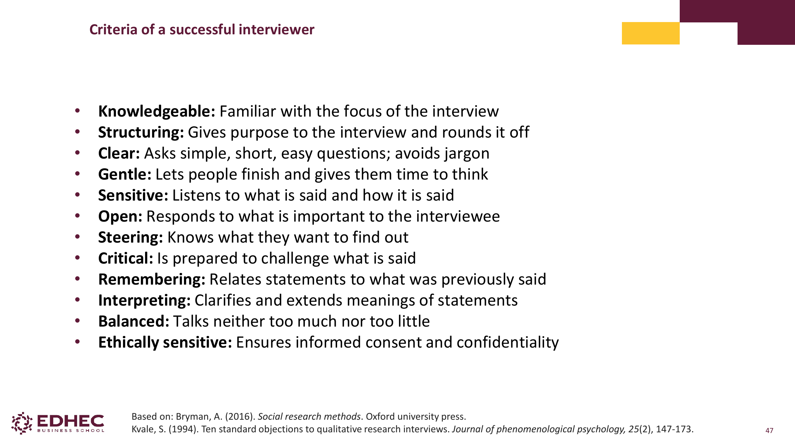

| Critère | Description |
|---|---|
| **Knowledgeable** | Familier avec le sujet |
| **Structuring** | Donne un sens à l'interview, la cadre |
| **Clear** | Questions simples, courtes, sans jargon |
| **Gentle** | Laisse parler, donne le temps de réfléchir |
| **Sensitive** | Écoute ce qui est dit ET **comment** c'est dit |
| **Open** | Répond à ce qui importe pour l'interviewé |
| **Steering** | Sait ce qu'il cherche |
| **Critical** | Prêt à challenger les déclarations |
| **Remembering** | Relie les déclarations entre elles |
| **Interpreting** | Clarifie et étend les sens |
| **Balanced** | Ni trop ni pas assez de prise de parole |
| **Ethically sensitive** | Garantit consentement et confidentialité |

---

## 13. Exemple de recherche : Retributive Philanthropy [slide 48-53]

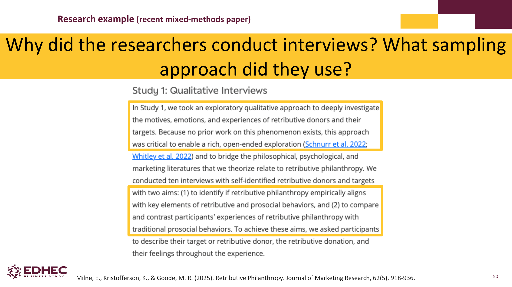

**Milne, Kristofferson & Goode (2025)**, *Journal of Marketing Research*, **62**(5), 918–936.

### Pourquoi des interviews ?
> "We took an exploratory qualitative approach to deeply investigate the **motives, emotions, and experiences** of retributive donors and their targets. Because no prior work on this phenomenon exists, this approach was critical to enable a rich, open-ended exploration."

### Setup
- **10 interviews** avec donateurs et cibles auto-identifiés
- Recrutement via **TikTok**
- Sujet : philanthropie de rétribution (donner pour punir quelqu'un — ex : donner à Planned Parenthood au nom de Mike Pence)

### Thème extrait
**"Volitional wrongdoing and negative moral judgments"** — les donateurs caractérisent leurs cibles comme ayant volontairement commis un acte fautif.

> **💡 Leçon clé** : on choisit la quali quand le phénomène est **nouveau** et **non encore théorisé**. Les chiffres ne savent pas mesurer ce qu'on n'a pas encore conceptualisé.

---

## 14. Exemple entreprise : IKEA Life at Home Report [slide 54-56]

- IKEA a publié un *Life at Home Report* chaque année depuis 2014
- Entre 2014 et 2024 : **>250 000 personnes sondées**, avec **interviews qualitatives en addition**
- Méthodes : home interviews, online communities, mobile ethnography, online in-depth interviews
- Pendant la pandémie 2020 : home visits déplacées en ligne

> **🎯 Take-away** : les grandes marques utilisent **systématiquement** un mix quali + quanti. La quali permet d'écouter — la quanti de mesurer.

---

## 15. Focus groups en détail [slide 58-69]

> **💡 Définition** : *"Focus groups are interviews conducted with a number of respondents at the same time and led by a moderator."* (Sarstedt & Mooi, 2019, p. 80)

### 15.1. Le modérateur [slide 61-62]

**Facilite la discussion** :
- Introduit le but et les objectifs
- Établit les **règles du jeu et la sécurité psychologique**
- Suit le guide tout en restant flexible
- Garde la conversation sur les rails
- **Encourage la participation équitable** (limiter les voix dominantes, inviter les plus discrets)

**Skills d'un bon modérateur** :
- Sait quand creuser pour des insights plus profonds
- Redirige doucement quand nécessaire
- Crée une atmosphère de confiance
- **Reste neutre, évite les questions leading**
- Laisse les participants s'exprimer dans leurs propres mots

### 15.2. L'observateur [slide 63]

- **Observe sans participer** (ne parle pas)
- Présent dans la même pièce ou derrière un miroir sans tain
- Tâches potentielles :
  - Écouter la discussion
  - Demander au modérateur de creuser certains points
  - Prendre des notes, des enregistrements
  - **Observer le langage corporel et la dynamique de groupe**
  - Récupérer des insights additionnels

> **⚠️ Différence à connaître pour l'examen** : modérateur = facilite + parle. Observateur = regarde + se tait. Ce n'est PAS le même rôle.

### 15.3. Procédure d'un focus group [slide 64]

1. Modérateur introduit le **sujet et le contexte**
2. Tout le monde se présente
3. Modérateur **encourage les membres à se parler entre eux** (pas de répondre uniquement au modérateur)
4. Les membres discutent les sujets selon le discussion guide ; le modérateur reste **en retrait**, juste pour rester on-topic
5. Briefing final des participants

### 15.4. Préparer le discussion guide en 7 étapes [slide 65]

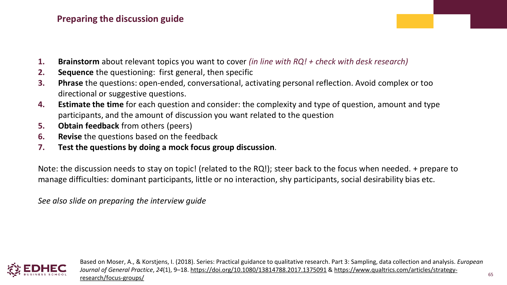

1. **Brainstorm** des sujets pertinents (alignés sur la RQ + check desk research)
2. **Sequence** : du général au spécifique
3. **Phrase** : open-ended, conversationnel, activant la réflexion personnelle. Éviter les questions complexes ou directives.
4. **Estimate the time** par question (en fonction de la complexité, du type de participants, de la quantité de discussion souhaitée)
5. **Obtain feedback** des pairs
6. **Revise** les questions selon le feedback
7. **Test** les questions avec un mock focus group (pilot)

> **⚠️ Note importante du slide** : la discussion DOIT rester on-topic. Préparer aussi à gérer : participants dominants, peu d'interaction, participants timides, social desirability bias.

### 15.5. Data collection en focus group [slide 69]

| Paramètre | Valeur |
|---|---|
| **Sample** | **6-10 personnes** par focus group (assez petit pour que tout le monde parle, assez grand pour la diversité) |
| **Durée** | **60 à 120 minutes** typiquement |
| **Type de données** | Enregistrements à transcrire + notes |

---

## 16. Exemple complet : Du, Sen & Bhattacharya (2008) [slide 70-74]

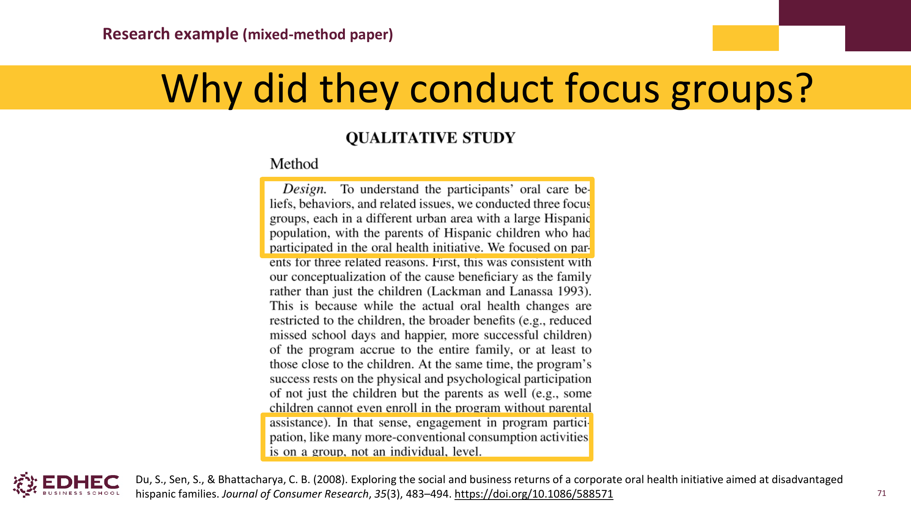

**Étude mixte** sur l'initiative orale d'une entreprise auprès de familles hispaniques défavorisées (*Journal of Consumer Research*).

### Pourquoi des focus groups ?
> "To understand the participants' oral care beliefs, behaviors, and related issues, we conducted **three focus groups**, each in a different urban area with a large Hispanic population, with the parents of Hispanic children who had participated in the oral health initiative."

### Setup
- **3 focus groups**, dans 3 zones urbaines différentes
- Critères de screening : (1) Hispanique auto-identifié, (2) 18-45 ans, (3) avec enfant(s) ayant complété ou presque complété le programme, (4) caretaker primaire
- **8 à 10 participants** par focus group
- **Payés 100 $** chacun
- Conduits **en espagnol** par un modérateur hispanique
- Vidéo enregistrés, traduits en anglais, transcrits

### Procédure
- Modérateur commence par des **questions générales** sur l'hygiène orale
- Puis **probing** sur les conversations avec les enfants, comportements oraux des enfants
- Questions sur le programme et son impact perçu
- Probing final sur les sentiments et comportements réciproques envers le sponsor

### Analyse [slide 73-74]
- Logiciel : **QSR NVIVO** pour coder, gérer, explorer les transcripts
- Approche **itérative** entre données et théorie émergente
- Trustworthiness via **triangulation** de citations multiples de différents focus groups
- Thème extrait : *"Outcome Beliefs and Oral Care Behavior"*

### Étude quantitative de suivi
- Mesures dérivées des findings qualitatifs (5-point Likert)
- Items basés sur les croyances physiques (2 items) et psychosociales (4 items) émergeantes des focus groups

> **💡 Leçon clé** : c'est le pattern classique du **mixed-method**. La quali sert à **conceptualiser** et formuler des items, la quanti à **tester** ces items à grande échelle.

---

## 17. Exemple récent : UNESCO online focus group [slide 75]

UNESCO Caribbean a hosted un focus group en ligne avec **18 femmes des Caraïbes** sur l'AI fairness et la sécurité en ligne. Démontre que les focus groups marchent aussi en visio, accessibles à des participants distants.

---

## 18. Outlook : Synthetic Data [slide 76-81]

> **💡 Hook** : et si on n'avait plus besoin d'interviewer de vraies personnes ? Les LLM peuvent-ils simuler des consommateurs ?

### 18.1. Ce qui se passe en pratique
- **PWC** : "Retail's invisible focus group: Testing strategy before it hits the shelf" — synthetic customers
- **SyntheticUsers** : startup qui propose des participants AI-générés pour user research
- Promesse : pas de recrutement, pas de payement, instant feedback

### 18.2. Les problèmes [slide 79-81]

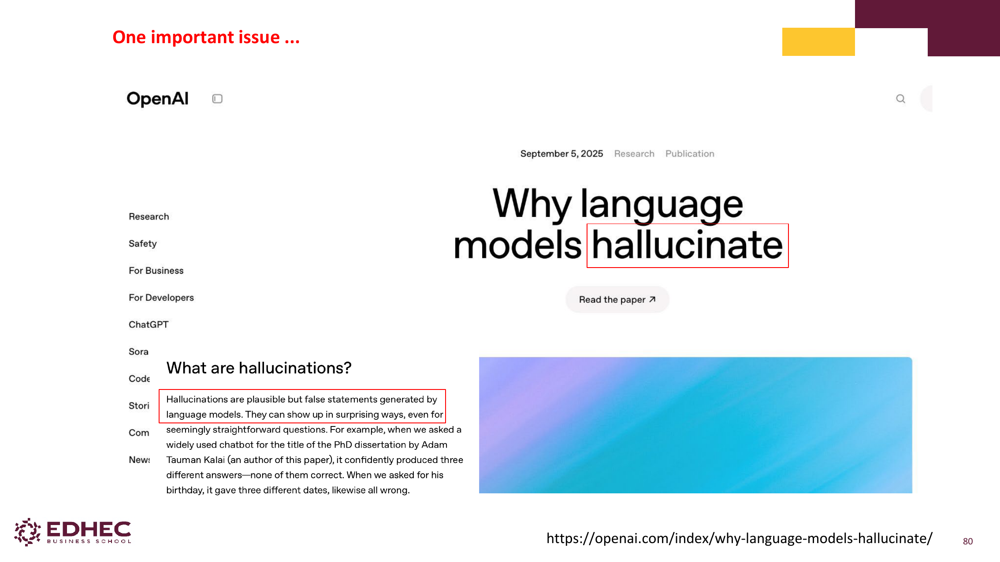

**Problème 1 : Hallucinations** (OpenAI, sept. 2025)
> *"Hallucinations are plausible but false statements generated by language models."*

**Problème 2 : Les LLMs ne simulent PAS la psychologie humaine**

Référence : **Schröder, Morgenroth, Kuhl, Vaquet, Paaßen (2025)** — *"Large Language Models Do Not Simulate Human Psychology"* (preprint, 13 août 2025).

> "Multiple researchers have investigated the question, i.e., whether LLMs truly think and respond like humans. **The evidence suggests: no.**"

> **⚠️ À retenir pour l'examen** : la question "peut-on remplacer les vrais participants par de la synthetic data ?" est ouverte. À date du cours (2026), la réponse de la recherche académique est **NON** — les LLMs hallucinent et ne simulent pas vraiment la psychologie humaine. Mais c'est un sujet brûlant à connaître.

---

## ✅ Test toi sur S1

**Q1** — Quand utilises-tu un focus group plutôt qu'une interview individuelle ?

> Quand la **dynamique de groupe** apporte de la valeur (idées qui émergent du collectif) et que le sujet n'est **pas sensible**. Pour un sujet intime ou tabou → interview.

**Q2** — Quelle est la différence centrale entre quali et quanti ?

> Quali = **explorer le pourquoi** avec des mots et peu de personnes. Quanti = **tester / quantifier** avec des chiffres et beaucoup de personnes.

**Q3** — C'est quoi la "data saturation" ?

> Le point où chaque nouvelle interview ne te donne **plus rien de neuf**. Les nouveaux thèmes arrêtent d'émerger. C'est le critère pour décider d'arrêter la collecte (Moser & Korstjens, 2018).

**Q4** — Quel est le sweet spot du nombre de participants par focus group ?

> **6 à 10 personnes**. Moins → pas assez de diversité. Plus → trop de compétition pour le temps de parole.

**Q5** — Qu'est-ce qu'une question "leading" et pourquoi l'éviter ?

> Une question qui **suggère sa réponse** : *"Vous êtes d'accord que…?"*. Elle biaise le répondant qui veut être agréable et confirme ce que tu sembles penser.

**Q6** — Cite 3 critères du bon interviewer (Kvale).

> Au choix parmi : Knowledgeable · Structuring · Clear · Gentle · Sensitive · Open · Steering · Critical · Remembering · Interpreting · Balanced · Ethically sensitive.

**Q7** — Pourquoi ne peut-on (pour l'instant) pas remplacer les participants par de la synthetic data ?

> Parce que les LLMs **hallucinent** (génèrent des affirmations plausibles mais fausses) et **ne simulent pas la psychologie humaine** (Schröder et al., 2025).

---

## 🎓 Points d'examen probables

- **Définition** de la recherche qualitative (Strauss & Corbin)
- **Tableau différenciation** quali vs quanti (les 7 dimensions)
- **Différence interview vs focus group** sur ≥3 dimensions (interaction, peer pressure, sujets sensibles)
- **3 types d'interviews** (non/semi/structurée) et quand les utiliser
- **Structure typique** d'un guide d'interview (les 7 étapes)
- **3 approches d'échantillonnage qualitatif** (purposive, convenience, snowball) avec exemples
- Concept de **data saturation**
- **Critères du bon interviewer** (Kvale, 1994) — peut-être citer 3-5
- Distinction **modérateur vs observateur** dans un focus group
- **Sample focus group** : 6-10 personnes, 60-120 min
- **Synthetic data** : la limite actuelle (hallucinations, pas de psychologie humaine)

---

## 📚 Références principales
- Strauss & Corbin (1998). *Basics of qualitative research techniques*. Sage.
- Fischer & Guzel (2023). The case for qualitative research. *Journal of Consumer Psychology*, 33(1), 259–272.
- Sarstedt & Mooi (2019). *A Concise Guide to Market Research* (3rd ed.). Springer.
- Bryman (2016). *Social research methods*. Oxford University Press.
- Kvale (1994). Ten standard objections to qualitative research interviews. *Journal of Phenomenological Psychology*, 25(2), 147–173.
- Moser & Korstjens (2018). Practical guidance to qualitative research. *European Journal of General Practice*, 24(1), 9–18.
- Milne, Kristofferson & Goode (2025). Retributive Philanthropy. *Journal of Marketing Research*, 62(5), 918–936.
- Du, Sen & Bhattacharya (2008). Corporate Oral Health Initiative. *Journal of Consumer Research*, 35(3), 483–494.
- Schröder, Morgenroth, Kuhl, Vaquet, Paaßen (2025). LLMs Do Not Simulate Human Psychology. *Preprint*.

---

## ⚠️ À vérifier
- Aucune ambiguïté détectée. Tous les slides 1-83 sont couverts.
