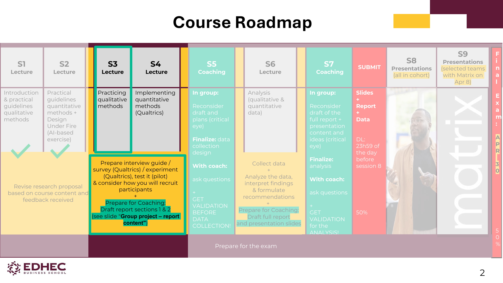
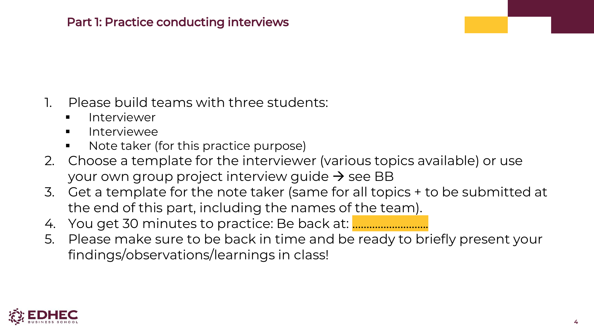
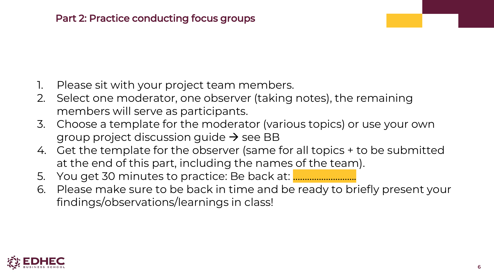

---
output:
  html_document: default
  pdf_document: default
---
# S3 · Practicing Qualitative Methods

> **Source** : `S3_PracticingQualitativeMethods.pdf` (9 pages)
> **Pages couvertes** : 1–9 ✅ exhaustif
> **Statut** : ✅ Complet
> **Type** : Session pratique en classe (peu de théorie nouvelle, beaucoup de logistique projet)

---

## 🎯 Pourquoi cette session existe

> **Hook** : Tu peux lire pendant des heures comment conduire une interview, mais tant que tu n'en as pas fait une vraie, tu ne sais pas. Cette session t'oblige à passer à l'acte, encadré, avant de le faire en autonomie pour ton projet Matrix.

**Idée centrale** : la théorie des méthodes qualitatives (S1) prend tout son sens quand on la pratique. S3 est la session "mise en jambes" : on s'entraîne en classe pour ne pas se planter sur le terrain.

---

## 1. Course Roadmap — vue d'ensemble du cours [slide 2 & 8]

### À retenir absolument : les deliverables entre chaque session

| Période | Ce que tu dois préparer |
|---|---|
| **Avant S3** | Réviser le research proposal selon le contenu du cours et le feedback reçu |
| **Avant S4** | Préparer **interview guide / survey Qualtrics / experiment Qualtrics**, faire un **pilot test**, réfléchir au **recrutement des participants**, et **rédiger les sections 1 & 2 du rapport** pour le coaching S5 |
| **Avant S5** | Plan finalisé, prêt pour validation par le coach |
| **S5 — Coaching** | "Critical eye" sur le draft + finalize data collection design + **GET VALIDATION BEFORE DATA COLLECTION** |
| **Avant S6** | (Rien de neuf, on reçoit le contenu d'analyse) |
| **Entre S6 et S7** | **Collecter les données** + analyser + interpréter + formuler des recommandations + draft full report et slides |
| **S7 — Coaching** | "Critical eye" sur le rapport complet + **GET VALIDATION FOR THE ANALYSIS** |
| **SUBMIT** | Slides + Report + Data, **deadline 23h59 la veille de S8** |
| **S8** | Présentations toute la cohorte |
| **S9** | Présentations sélectionnées devant **Matrix** (le 8 avril) |
| **30 avril** | **Examen final** (50% de la note) |

> **💡 Intuition** : le cours a deux temps. **Avant S6** = tu prépares ton dispositif (sans collecter). **Après S6** = tu collectes et analyses. Tu ne dois JAMAIS commencer la collecte sans la validation du coach en S5.

> **⚠️ Piège** : commencer à collecter les données avant d'avoir reçu la validation S5 = risque énorme de devoir tout refaire. Le coaching n'est pas optionnel.

---

## 2. Outils à installer [slide 3]

| Outil | Pour quoi | Quand |
|---|---|---|
| **Qualtrics** | Surveys + designs expérimentaux | **ASAP** (dès maintenant) |
| **SPSS** | Analyse quantitative | Avant la **Session 6** |
| **Taguette** | Codage qualitatif | Avant la **Session 6** |

> **🎯 Action concrète** : si tu ne l'as pas encore fait, va sur Blackboard, rubrique **"Tools file on BB"**, et installe les 3.

---

## 3. Part 1 — Pratique d'interviews [slide 4]

### Setup
- **Équipes de 3 étudiants** :
  - 1 **Interviewer**
  - 1 **Interviewee**
  - 1 **Note taker** (pour cette session uniquement, pas dans la vraie vie)
- Choisir un **template** d'interviewer (plusieurs sujets dispo sur BB) OU utiliser le **guide d'interview de votre projet**
- Récupérer le template de **note taker** (identique pour tous, à rendre à la fin avec les noms de l'équipe)
- **30 minutes** chrono
- Être prêt à présenter brièvement vos observations/learnings en classe

### Pourquoi un note taker en pratique seulement ?
> **💡 Intuition** : sur le terrain, tu enregistres l'audio (avec consentement) et tu retranscris ensuite. Un note taker en plus n'est pas standard — mais ici, il sert à observer la dynamique pour donner du feedback à l'interviewer.

---

## 4. Part 2 — Pratique de focus groups [slide 6]

### Setup
- **S'asseoir avec votre équipe projet Matrix**
- Distribuer les rôles :
  - **1 modérateur** (mène la discussion)
  - **1 observateur** (prend des notes sur la dynamique de groupe)
  - **Le reste** = participants
- Choisir un template de modérateur OU utiliser le **discussion guide de votre projet**
- Récupérer le template d'**observateur** (identique pour tous, à rendre à la fin)
- **30 minutes** chrono
- Présentation brève en classe

### Différence rôle modérateur vs observateur
> **💡 Intuition** : le modérateur fait parler le groupe et gère le temps. L'observateur ne parle pas — il regarde qui prend la parole, qui se tait, comment les opinions se forment. Les deux rôles sont complémentaires.

---

## ✅ Test toi sur S3

**Q1** — Tu finalises ton plan de collecte de données. Tu peux commencer à recruter des participants ?

> **Réponse** : **Non, pas avant la validation du coach en S5.** "GET VALIDATION BEFORE DATA COLLECTION" est explicite dans la roadmap.

**Q2** — Quels sont les 3 rôles dans la pratique d'interview en S3 ?

> **Réponse** : Interviewer, Interviewee, **Note taker**. (Le note taker est spécifique à cette session pratique — il n'existe pas dans une vraie interview où on enregistre.)

**Q3** — Quelle est la deadline pour soumettre slides + report + data ?

> **Réponse** : **23h59 la veille de la Session 8.** Pas le jour J de S8.

**Q4** — Avant S4, qu'est-ce que tu dois avoir préparé ?

> **Réponse** : (1) interview guide / survey Qualtrics / experiment Qualtrics, (2) **pilot test** réalisé, (3) plan de **recrutement des participants**, (4) draft des sections 1 & 2 du rapport.

---

## 🎓 Points d'examen potentiels (probabilité faible mais à connaître)

S3 étant une session pratique, peu de questions de cours probables. Mais :
- Les **3 outils du cours** (Qualtrics, SPSS, Taguette) — peut être demandé "lequel pour quoi"
- La **différence entre modérateur et observateur** dans un focus group
- Le **rôle du pilot test** avant la collecte (concept à connaître pour S2 et S4)

---

## 📚 Références
- EDHEC Marketing Research Methods, Session 3 slides (2026)
- Tools file on Blackboard

---

## ⚠️ À vérifier
- Aucune ambiguïté détectée dans les 9 slides.
